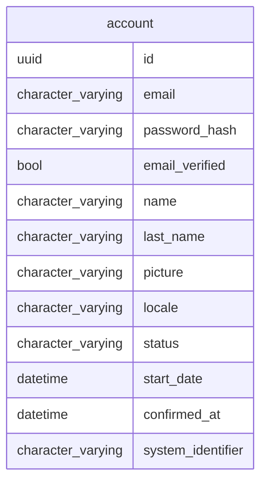

# Accounts Management SaaS

Manage users accounts, services access SaaS

## Model



## Dependencies

tbd

## Running


```shell
direnv allow
mix setup
mix deps.update --all
mix test

mix format # format code
mix credo # like rubocop
mix coveralls.html # code coverage
mix deps.audit # libraries vulnerabilities check
mix sobelow # security static code check
mix dialyzer # static analysis tool for Erlang
mix docs # gen doc

mix phx.server
open http://localhost:4000/api/accounts
```

## Routes

```shell
# simplified routes
mix phx.routes | grep '/api' | awk '{print $2 " " $3}' | sed '/.*Controller/d'

# seed some data
mix run priv/repo/seeds.exs
```
