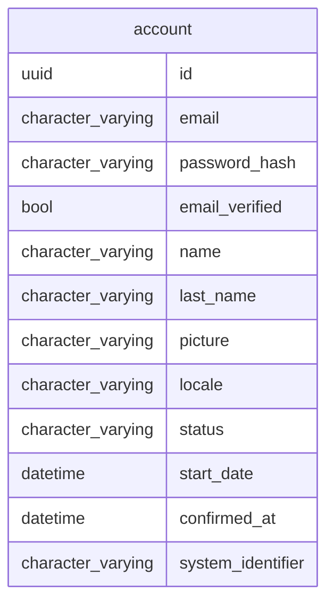

# Accounts Management SaaS

Manage users accounts, services access SaaS

## Model



## Dependencies

tbd

## Running


```shell
direnv allow
mix setup
mix deps.update --all
mix test

mix format # format code
mix credo # like rubocop
mix coveralls.html # code coverage
mix deps.audit # libraries vulnerabilities check
mix sobelow # security static code check
mix dialyzer # static analysis tool for Erlang
mix docs # gen doc

mix phx.server
open http://localhost:4000/api/accounts
```

## Routes

```shell
# simplified routes
mix phx.routes | grep '/api' | awk '{print $2 " " $3}' | sed '/.*Controller/d'

# seed some data
mix run priv/repo/seeds.exs
```

## Executing with docker

```sh
# build:
docker image build -t accounts_management_api-web .
# shell:
docker container run --rm -it --entrypoint "" -p 127.0.0.1:8080:8080  --env-file ./.docker.env accounts_management_api-web sh
# run:
docker container run --rm -it -p 127.0.0.1:8080:8080 --name accounts_management_api --env-file ./.docker.env accounts_management_api-web
# exec:
docker container exec -it accounts_management_api sh
# logs:
docker container logs --follow --tail 100 accounts_management_api
# compose:
docker-compose up
```

## Deployment

### Google Cloud

[Install & Configuration](https://cloud.google.com/sdk/docs/install)

#### Client dependency

```sh
./bin/gcloud init
gcloud config set project taskero
gcloud components update
gcloud components install kubectl
```

#### DB creation

[Create postgres instance](https://console.cloud.google.com/sql/instances/taskero/)

- vCPUs         1
- Memory        614.4 MB
- HDD storage   10 GB

```sh
gcloud sql instances create mb-apps-db --region=us-central1 \
    --database-version=POSTGRES_14 --tier=db-f1-micro

gcloud sql instances describe mb-apps-db
gcloud sql users set-password postgres \
    --instance=mb-apps-db --prompt-for-password
```

To access from our PC, lets install the SQL proxy

```sh
cd ~/code/tools
gcloud auth login
gcloud config set project taskero
gcloud auth application-default login

curl -o cloud-sql-proxy https://storage.googleapis.com/cloud-sql-connectors/cloud-sql-proxy/v2.1.2/cloud-sql-proxy.darwin.amd64
chmod +x cloud-sql-proxy

./cloud-sql-proxy  taskero-382720:us-central1:mb-apps-db

psql -U postgres -h 127.0.0.1 -d postgres
```

#### Migration

```sh
# Now we can access directly
MIX_ENV=prod mix ecto.create
MIX_ENV=prod mix ecto.migrate
```

#### Deploy a new release

```sh
# create the rel dir with configs
mix release.init
# Add `releases` to `mix.exs`
# Add `configs` to `config/prod.exs`
yes | MIX_ENV=prod mix release accounts_management_api
mix phx.digest

# test
# Start the sql proxy
 ~/code/tools/cloud-sql-proxy  taskero-382720:us-central1:mb-apps-db
PORT=$GCLOUD_PORT _build/prod/rel/accounts_management_api/bin/accounts_management_api start
# http://localhost:8080/api/accounts

cd scripts/deployment
gcloud run deploy taskero --source .
```


<!-- ########## REMOVE


# Create instance
gcloud compute instances create taskero \
    --project=taskero-382720 \
    --zone=us-east5-a \
    --machine-type=e2-micro \
    --network-interface=network-tier=PREMIUM,subnet=default \
    --maintenance-policy=MIGRATE \
    --provisioning-model=STANDARD \
    --service-account=761492695455-compute@developer.gserviceaccount.com \
    --scopes=https://www.googleapis.com/auth/devstorage.read_only,https://www.googleapis.com/auth/logging.write,https://www.googleapis.com/auth/monitoring.write,https://www.googleapis.com/auth/servicecontrol,https://www.googleapis.com/auth/service.management.readonly,https://www.googleapis.com/auth/trace.append \
    --tags=http-server,https-server \
    --create-disk=auto-delete=yes,boot=yes,device-name=taskero,image=projects/debian-cloud/global/images/debian-11-bullseye-v20230306,mode=rw,size=10,type=projects/taskero-382720/zones/us-west4-b/diskTypes/pd-balanced \
    --no-shielded-secure-boot \
    --shielded-vtpm \
    --shielded-integrity-monitoring \
    --labels=ec-src=vm_add-gcloud \
    --reservation-affinity=any

# Add SSH
cat ~/.ssh/id_rsa.pub | pbcopy

# copy external IP address from network interface
gcloud compute instances list
# 34.162.190.126

# Add SSH alias
echo "

Host taskero
 Hostname 34.162.190.126
 User matiasberrueta
Host *
 AddKeysToAgent yes
 UseKeychain yes
 IdentityFile ~/.ssh/id_rsa
 " > ~/.ssh/config

 # Access server
 ssh taskero
```

#### server

```sh
#  Allow SWAP memory to allow compile (it only have 1GB)
sudo fallocate -l 1G /swapfile
sudo chmod 600 /swapfile
sudo mkswap /swapfile
sudo swapon /swapfile
echo '/swapfile none swap sw 0 0' | sudo tee -a /etc/fstab

# Install deps
yes | sudo apt install postgresql postgresql-contrib wget git
wget https://packages.erlang-solutions.com/erlang-solutions_2.0_all.deb && sudo dpkg -i erlang-solutions_2.0_all.deb
sudo apt update
sudo apt install esl-erlang
sudo apt install elixir
# Today 4-Apr-2023 this installed 1.13 elixir we need 1.14
sudo apt remove elixir

git clone https://github.com/asdf-vm/asdf.git ~/.asdf --branch v0.11.3

echo '. "$HOME/.asdf/asdf.sh"' >> ~/.bashrc
echo '. "$HOME/.asdf/completions/asdf.bash"' >> ~/.bashrc

yes | sudo apt install dirmngr gpg curl gawk build-essential libssl-dev automake libncurses5-dev unzip
source ~/.bashrc
asdf plugin add erlang https://github.com/asdf-vm/asdf-erlang.git
asdf install erlang 25.3
asdf global erlang 25.3
asdf plugin-add elixir https://github.com/asdf-vm/asdf-elixir.git
asdf install elixir 1.14.3-otp-25
asdf global elixir 1.14.3-otp-25
elixir -v
``` -->
