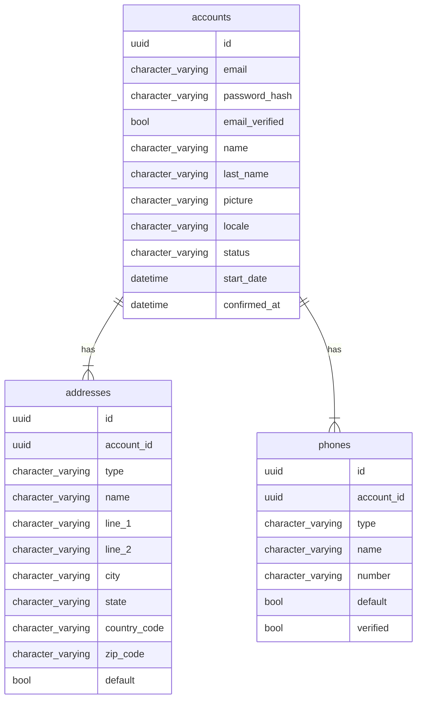

# Accounts Management SaaS

Manage users accounts, services access SaaS

## Model



## Dependencies

tbd

## Running


```shell
direnv allow
mix setup
mix deps.update --all
mix test

mix format # format code
mix credo # like rubocop
mix coveralls.html # code coverage
mix deps.audit # libraries vulnerabilities check
mix sobelow # security static code check
mix dialyzer # static analysis tool for Erlang
mix docs # gen doc

mix phx.server
open http://localhost:4000/api/accounts
```

## Routes

```shell
# simplified routes
mix phx.routes | grep '/api' | awk '{print $2 " " $3}' | sed '/.*Controller/d'

# seed some data
mix run priv/repo/seeds.exs
```

## Executing with docker

```sh
# build:
docker image build -t accounts_management_api-web .
# shell:
docker container run --rm -it --entrypoint "" -p 127.0.0.1:8080:8080  --env-file ./.docker.env accounts_management_api-web sh
# run:
docker container run --rm -it -p 127.0.0.1:8080:8080 --name accounts_management_api --env-file ./.docker.env accounts_management_api-web
# exec:
docker container exec -it accounts_management_api sh
# logs:
docker container logs --follow --tail 100 accounts_management_api
# compose:
docker-compose up
```

## Deployment

### Fly.IO

[Install & Configuration](https://hexdocs.pm/phoenix/fly.html)

#### Client dependency

```sh
brew install flyctl
flyctl auth login
flyctl launch

# ? Choose an app name (leave blank to generate one): accounts-management-api
# ? Select Organization: taskero (taskero)
# ? Choose a region for deployment: Sao Paulo, Brazil (gru)
# Admin URL: https://fly.io/apps/accounts-management-api
# Hostname: accounts-management-api.fly.dev
# Set secrets on accounts-management-api: SECRET_KEY_BASE
# ? Would you like to set up a Postgresql database now? Yes
# ? Select configuration: Development - Single node, 1x shared CPU, 256MB RAM, 1GB disk
# https://accounts-management-api.fly.dev/api/accounts

fly secrets set MY_SECRET_KEY=my_secret_value
fly deploy
fly status
fly logs
fly open
```
