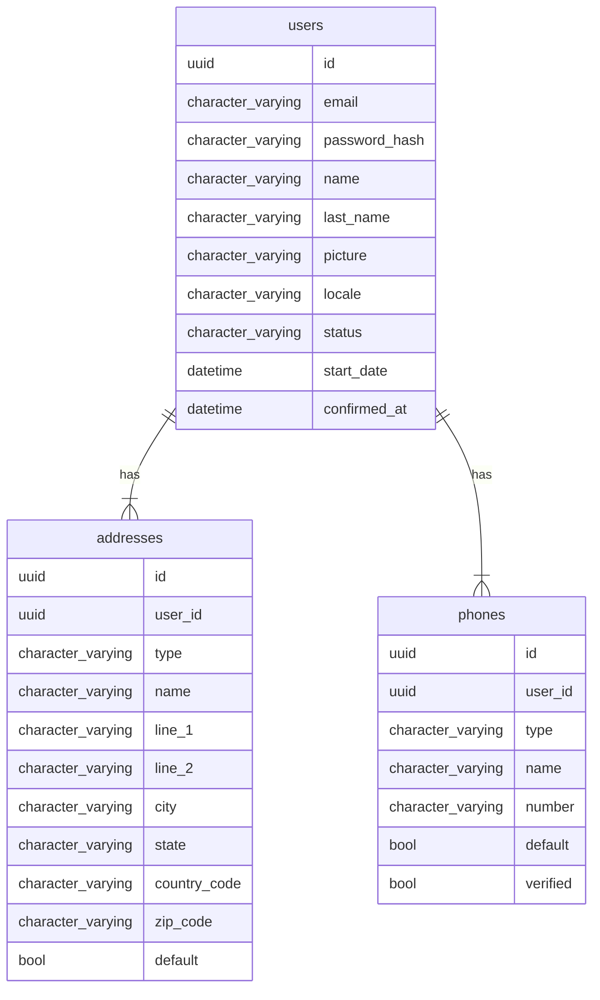

# Accounts Management Lib

Manage users accounts Lib.
Allow to extract the dependency between app and accounts management.

## Model



## Dependencies

Not for now

## Include in your project


`mix.exs`

```elixir
defp deps do
[
  # ...
] ++ internal_deps()
end

defp internal_deps() do
  [
    # After dev things
    # {:accounts_management_api, "~> 0.1.0", git: "https://github.com/Taskero/accounts_management_api.git", branch: "main"},
    {:accounts_management_api, "~> 0.1.0", path: "../accounts_management_api"}
  ]
end
```

`config/config.exs`

```elixir
 import Config

 config :project,
-  ecto_repos: [Project.Repo],
+  ecto_repos: [Project.Repo, AccountsManagementAPI.Repo],

+config :accounts_management_api, AccountsManagementAPIWeb.Endpoint,
+  url: [host: "localhost"],
+  render_errors: [
+    formats: [json: AccountsManagementAPIWeb.ErrorJSON],
+    layout: false
+  ],
+  pubsub_server: AccountsManagementAPI.PubSub,
+  live_view: [signing_salt: "SOMETHING"]
```

`config/test.exs`

```elixir
+config :accounts_management_api, AccountsManagementAPI.Repo,
+  username: System.get_env("DB_USERNAME"),
+  password: System.get_env("DB_PASSWORD"),
+  hostname: System.get_env("DB_HOSTNAME"),
+  database: "db_test#{System.get_env("MIX_TEST_PARTITION")}",
+  pool: Ecto.Adapters.SQL.Sandbox,
+  pool_size: 10
+
+config :accounts_management_api, AccountsManagementAPIWeb.Auth.Guardian,
+  secret_key: "SECRET_KEY_BASE"
```

`lib/project_web/router.ex` for rest API

```elixir
+  pipeline :auth do
+    plug AccountsManagementAPIWeb.Auth.Pipeline
+  end
+
+  # API ####################
+
+  # Unsecure routes
+  scope "/api", AccountsManagementAPIWeb do
+    pipe_through :api
+
+    resources "/auth", AuthController, only: [:create]
+    resources "/auth/refresh", AuthController, only: [:create]
+    resources "/users", UserController, only: [:create]
+  end
+
+  # Secure routes
+  scope "/api", AccountsManagementAPIWeb do
+    pipe_through [:api, :auth]
+
+    resources "/users", UserController, only: [:index, :show, :update, :delete] do
+      resources("/addresses", AddressController, only: [:index, :create, :show, :update, :delete])
+      resources("/phones", PhoneController, only: [:index, :create, :show, :update, :delete])
+    end
+  end
```

For testing create a [ExMachina Factory](https://github.com/thoughtbot/ex_machina) `/test/support/factories.ex`

```elixir
defmodule AccountsManagementAPI.Test.Factories do
+  use ExMachina.Ecto, repo: AccountsManagementAPI.Repo
+  alias AccountsManagementAPI.Accounts.{User, Address, Phone}
+
+  def user_factory do ... end
+  def address_factory do ... end
+  def phone_factory do ... end
end
```

create the test with:

```elixir
defmodule ExampleControllerTest do
  use ProjectWeb.ConnCase

  import AccountsManagementAPI.Test.Factories

  setup do
    # Explicitly get a connection before each test
    :ok = Ecto.Adapters.SQL.Sandbox.checkout(AccountsManagementAPI.Repo)
  end
```

Happy coding 🐣
