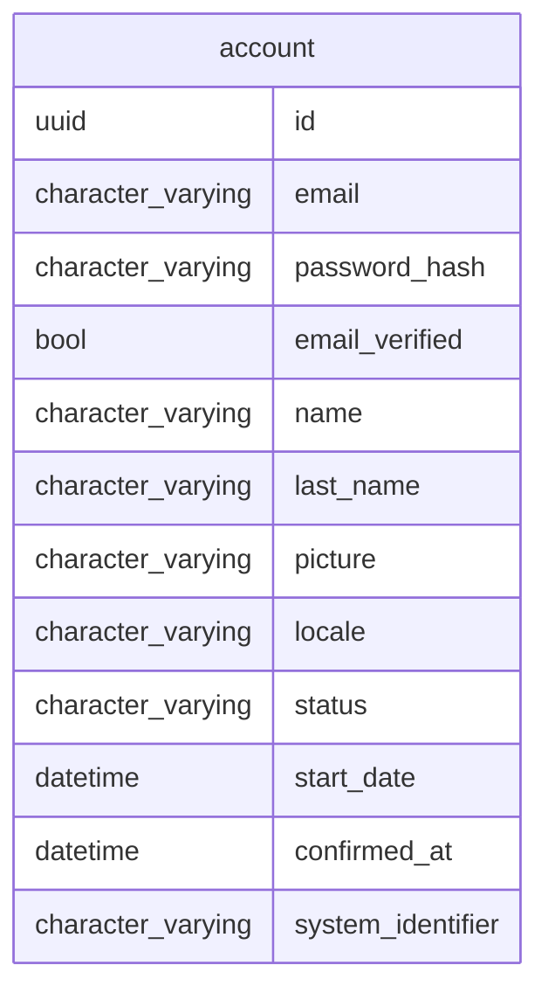

# Accounts Management SaaS

Manage users accounts, services access SaaS

## Model



## Dependencies

tbd

## Running


```shell
direnv allow
mix setup
mix deps.update --all
mix test

mix format # format code
mix credo # like rubocop
mix coveralls.html # code coverage
mix deps.audit # libraries vulnerabilities check
mix sobelow # security static code check
mix dialyzer # static analysis tool for Erlang
mix docs # gen doc

mix phx.server
open http://localhost:4000/api/accounts
```

## Routes

```shell
# simplified routes
mix phx.routes | grep '/api' | awk '{print $2 " " $3}' | sed '/.*Controller/d'

# seed some data
mix run priv/repo/seeds.exs
```

## Executing with docker

```sh
# build:
docker image build -t accounts_management_api-web .
# shell:
docker container run --rm -it --entrypoint "" -p 127.0.0.1:8080:8080  --env-file ./.docker.env accounts_management_api-web sh
# run:
docker container run --rm -it -p 127.0.0.1:8080:8080 --name accounts_management_api --env-file ./.docker.env accounts_management_api-web
# exec:
docker container exec -it accounts_management_api sh
# logs:
docker container logs --follow --tail 100 accounts_management_api
# compose:
docker-compose up
```

## Deployment

### Elastic Beanstalk

[Official Elastic Beanstalk CLI installation instructions](https://github.com/aws/aws-elastic-beanstalk-cli-setup)


Configuration

```sh
eb init -p docker accounts_management_api

# Select a default region
# 11) sa-east-1 : South America (Sao Paulo)
# (default is 3): 11
# You have not yet set up your credentials or your credentials are incorrect
# You must provide your credentials.
# https://sa-east-1.console.aws.amazon.com/iamv2/home#/security_credentials

# Enter Application Name
# (default is "accounts_management_api"):
# Application accounts_management_api has been created.

# It appears you are using Docker. Is this correct?
# (Y/n): Y
# Select a platform branch.
# 1) Docker running on 64bit Amazon Linux 2
# (default is 1):

# Do you wish to continue with CodeCommit? (Y/n): Y

# Enter Repository Name
# (default is "accounts_management_api"):
# Successfully created repository: accounts_management_api

# Enter Branch Name
# ***** Must have at least one commit to create a new branch with CodeCommit *****
# (default is "deploy"):
# Username for 'https://git-codecommit.sa-east-1.amazonaws.com/v1/repos/accounts_management_api': matias.berrueta@gmail.com
# Password for 'https://matias.berrueta@gmail.com@git-codecommit.sa-east-1.amazonaws.com/v1/repos/accounts_management_api':
# Successfully created branch: deploy
# Do you want to set up SSH for your instances?
# (Y/n): Y

# Type a keypair name.
# (Default is aws-eb):
# Generating public/private rsa key pair.
# Enter passphrase (empty for no passphrase):
# Enter same passphrase again:
```

Local test

```sh
while read -r i; do
  eb local setenv $i
done < ./scripts/deployment/.docker.env


eb local printenv
eb local open
eb local run --port 8080

open http://localhost:8080/api/accounts
```

prod

[AWS EB console](https://sa-east-1.console.aws.amazon.com/elasticbeanstalk/home?region=sa-east-1#/environment/configuration?environmentId=e-zt64kwxy92)

```sh
while read -r i; do
  eb setenv $i
done < ./scripts/deployment/.docker.prod.env

# first time
eb create --verbose

#
eb deploy --verbose
```
